Hey, my name is Sadid Karami, and I'm a 3rd year Computer Science Major at the University of Calgary. I've got experience in software development, data analysis and visualization, databases, and cloud development. Feel free to look through my projects and you can reach me via email or LinkedIn!

Languages:

  
  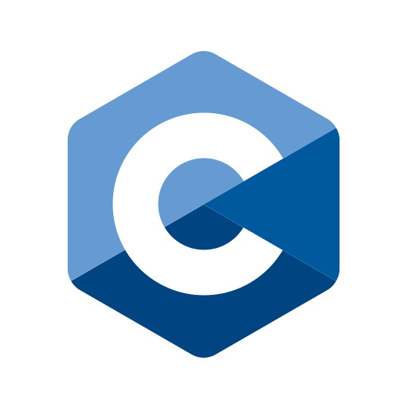
  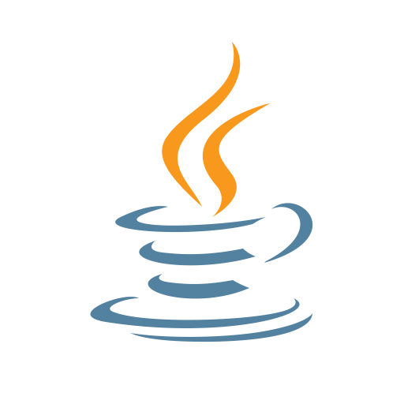
  
  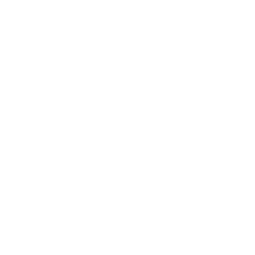
  
  
  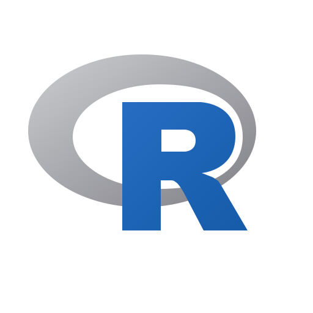

Frameworks:

  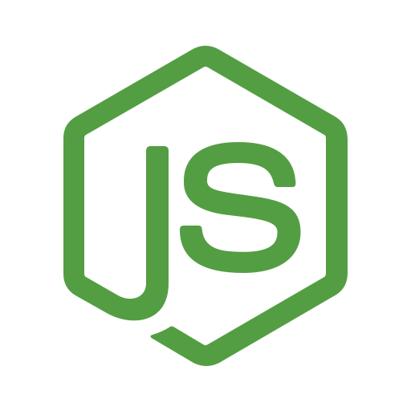
  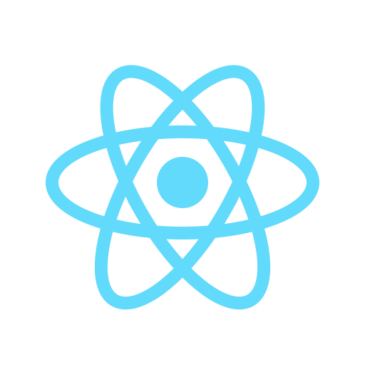
  
  

Technologies:

  
  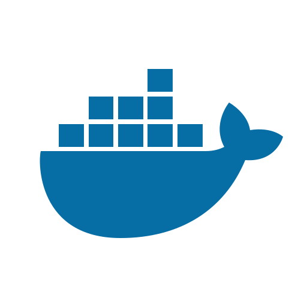
  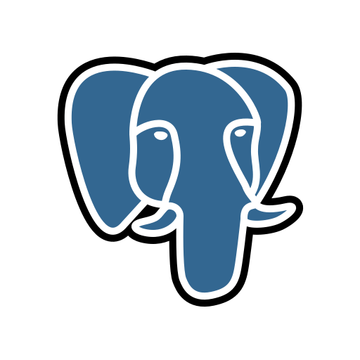
  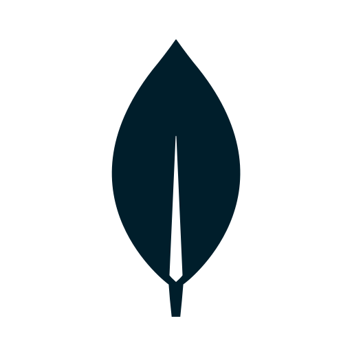
  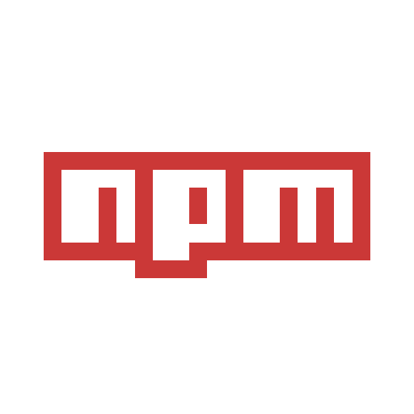
  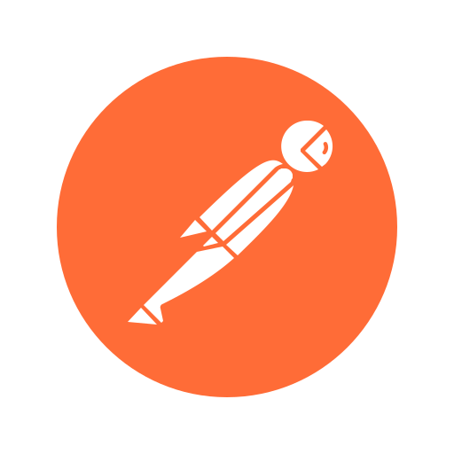
  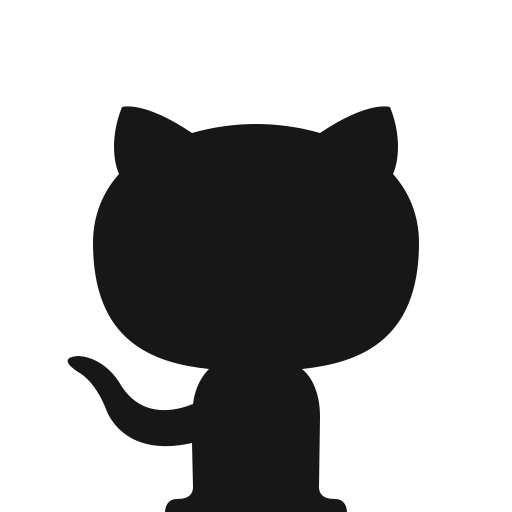
  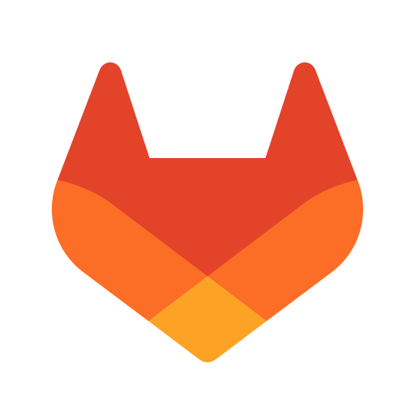
  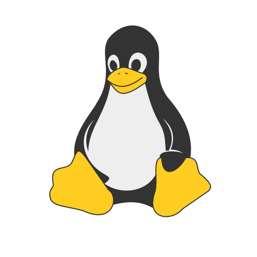
  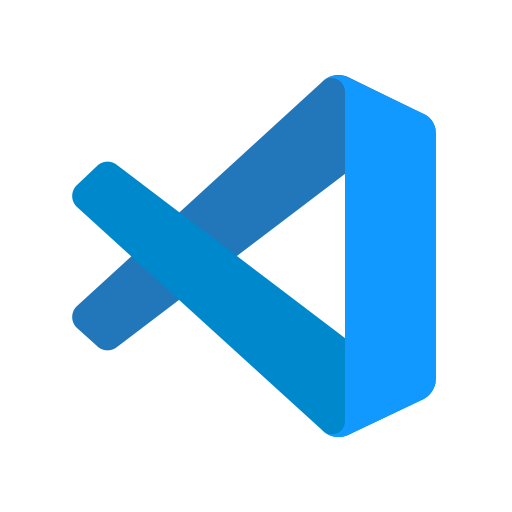

